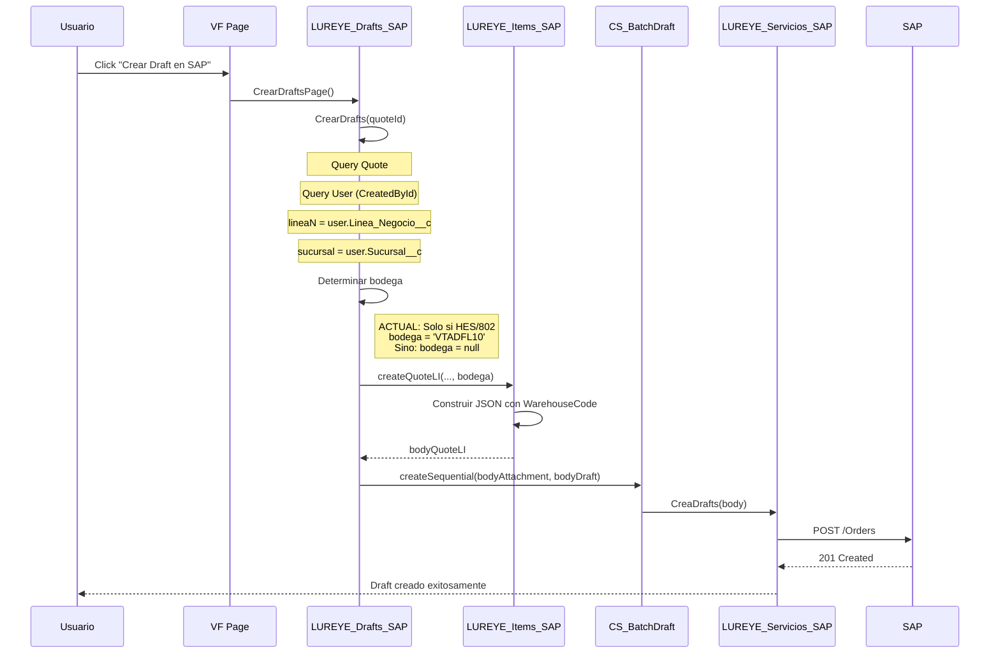

# Ticket 00024376 - Asignación Dinámica de Bodegas en OV SAP

## 📋 Tabla de Contenidos
1. [Contexto General](#contexto-general)
2. [Problema Actual](#problema-actual)
3. [Solución Propuesta](#solución-propuesta)
4. [Requerimientos del Cliente](#requerimientos-del-cliente)
5. [Análisis Técnico Detallado](#análisis-técnico-detallado)
6. [Plan de Implementación](#plan-de-implementación)

---

## 1. Contexto General {#contexto-general}

### Proceso Actual de Creación de OV en SAP

**Flujo de trabajo:**
```
Quote (SF) → Botón "Crear Draft en SAP" → LUREYE_Drafts_SAP → SAP Orders endpoint
```

**Clases involucradas:**
- `LUREYE_Drafts_SAP.cls` - Controlador principal que construye el JSON
- `LUREYE_Items_SAP.cls` - Construye la sección `DocumentLines` del JSON
- `LUREYE_Servicios_SAP.cls` - Métodos `CreaDrafts()` y `CreaOV()` que envían a SAP
- `CS_BatchDraft.cls` - Ejecuta el proceso en batch

**JSON enviado a SAP:**
```json
{
    "CardCode": "C16367215",
    "BPL_IDAssignedToInvoice": 1,
    "Series": "13",
    "DocDueDate": "2025-10-30",
    "DocCurrency": "$",
    "NumAtCard": "123745",
    "PaymentGroupCode": "5",
    "DocObjectCode": "17",
    "SalesPersonCode": "-1",
    "Comments": "Prueba 2",
    "U_IDCajaHisto": "SF:0Q0O5000001iWObKAM",
    "U_EXX_FE_TDBSII": "Venta Normal",
    "Name": "JORGE DÍAZ",
    "U_URL_ANEXO": null,
    "DocumentLines": [
        {
            "ItemCode": "200000367",
            "Quantity": "1.00",
            "TaxCode": "IVA",
            "CostingCode": "...",
            "UnitPrice": "41338.00",
            "WarehouseCode": "VTADFL10"  // ← SOLO se envía para HES-802
        }
    ],
    "AddressExtension": { ... }
}
```

### Datos de Usuario utilizados

La integración obtiene datos del **Usuario que crea la cotización** (`Quote.CreatedById`):

**Campos del Usuario (User):**
- `Linea_Negocio__c` - Number(5,0) - Código de línea de negocio SAP
  - Ejemplos: 10000, 15000, 21000, 22000
- `Sucursal__c` - Text(5) - Código de sucursal
  - Ejemplos: "SANT", "ANTO", "TALC", "PMON"
- `CodigoUN__c` - Text(2) - Código Unidad de Negocio
  - Ejemplos: "GE", "EM", "SE"
- `Branch__c` - Number - ID de sucursal en SAP
- `Centro_Costo__c` - Para CostingCode
- `Codigo_SAP__c` - Código del vendedor en SAP

**Campos de la Cotización (Quote):**
- `RequiereHES__c` - Picklist: "Venta Normal", "HES", "802", "801"
- `CondicionPago__c` - Picklist con múltiples opciones
- `Glosa__c` - Texto libre

---

## 2. Problema Actual {#problema-actual}

### Situación Actual

Actualmente, el campo `WarehouseCode` en `DocumentLines` **SOLO se envía** en un caso específico:

**Código actual** (`LUREYE_Drafts_SAP.cls` líneas 173-182):
```apex
if (qryQuote.Propiedades__c != null){
    propiedades = qryQuote.Propiedades__c;
    propHES     = qryQuote.RequiereHES__c;

    if(propHES == 'HES' || propHES == '802')
    {
        bodega = 'VTADFL10'; // Bodega fija para HES-802
    }        
}
```

**Resultado:**
- ✅ Si `RequiereHES__c = 'HES'` o `'802'` → Envía `WarehouseCode: "VTADFL10"`
- ❌ En todos los demás casos → **NO envía bodega** → SAP usa bodega por defecto

### Impacto

El proyecto WMS requiere que cada OV se cree en la bodega correcta según reglas de negocio. Sin este campo, todas las OV se crean en una bodega genérica, causando:

- Problemas de inventario
- Dificultad en tracking de productos
- Procesos manuales adicionales para reubicar mercadería
- Reportería incorrecta por bodega

---

## 3. Solución Propuesta {#solución-propuesta}

### Alto Nivel

Implementar una lógica que determine dinámicamente el `WarehouseCode` basándose en:

1. **Línea de Negocio del Usuario** (`User.Linea_Negocio__c`)
2. **Sucursal del Usuario** (`User.Sucursal__c`)
3. **Condición de Pago de la Cotización** (`Quote.CondicionPago__c` o `Quote.RequiereHES__c`)

### Arquitectura de la Solución

```
┌─────────────────────────────────────────────────────────┐
│  Quote (Cotización)                                     │
│  - CreatedById → User                                   │
│  - RequiereHES__c                                       │
│  - CondicionPago__c                                     │
└────────────────┬────────────────────────────────────────┘
                 │
                 ↓
┌─────────────────────────────────────────────────────────┐
│  LUREYE_Drafts_SAP.CrearDrafts()                       │
│  1. Consulta User.Linea_Negocio__c                     │
│  2. Consulta User.Sucursal__c                          │
│  3. Consulta Quote.RequiereHES__c                      │
│  4. Determina bodega según matriz de reglas            │
└────────────────┬────────────────────────────────────────┘
                 │
                 ↓
┌─────────────────────────────────────────────────────────┐
│  Matriz de Bodegas (Custom Metadata o Clase Helper)    │
│  - Input: Linea_Negocio + Sucursal + RequiereHES       │
│  - Output: WarehouseCode                               │
└────────────────┬────────────────────────────────────────┘
                 │
                 ↓
┌─────────────────────────────────────────────────────────┐
│  LUREYE_Items_SAP.createQuoteLI()                      │
│  - Agrega "WarehouseCode": "VTLE" en DocumentLines     │
└────────────────┬────────────────────────────────────────┘
                 │
                 ↓
┌─────────────────────────────────────────────────────────┐
│  SAP Business One                                       │
│  - Recibe OV con bodega específica                     │
│  - Asigna inventario correctamente                     │
└─────────────────────────────────────────────────────────┘
```

### Configurabilidad

Para hacerlo **configurable** (requisito del cliente), crear **Custom Metadata Type**: `Bodega_SAP__mdt`

**Campos:**
- `Linea_Negocio__c` - Text(50) - Puede contener múltiples valores separados por coma
- `Sucursal__c` - Text(50) - Puede contener múltiples valores o "TODAS"
- `Requiere_HES__c` - Text(10) - Valor específico o "TODAS"
- `Codigo_Bodega_SAP__c` - Text(20) - Código de bodega en SAP
- `Nombre_Bodega__c` - Text(100) - Nombre descriptivo
- `Activo__c` - Checkbox
- `Prioridad__c` - Number(2,0) - Para resolver conflictos

---

## 4. Requerimientos del Cliente {#requerimientos-del-cliente}

### Matriz de Bodegas Solicitada

| # | Línea de Negocio | Sucursal | Condición | Código Bodega | Nombre Bodega |
|---|------------------|----------|-----------|---------------|---------------|
| 1 | RELACIONAL (21000) | TODAS | Normal | VTLE | BODEGA VENTAS GENERACION LO ESPEJO |
| 2 | PROYECTO (15000) | TODAS | Normal | VTLE | BODEGA VENTAS GENERACION LO ESPEJO |
| 3 | TRANSACCIONAL (10000) | TODAS | Normal | VTLE | BODEGA VENTAS GENERACION LO ESPEJO |
| 4 | SERVICIO (22000) | SANTIAGO | Normal | ST10 | BOD. DE REPTO. CENTRAL SERVICIO TECNICO |
| 5 | SERVICIO (22000) | ANTOFAGASTA | Normal | STA10 | BODEGA SERVICIOS ANTOFAGASTA |
| 6 | SERVICIO (22000) | PUERTO MONTT | Normal | STSP10 | BODEGA SERVICIOS PTO. MONTT |
| 7 | SERVICIO (22000) | TALCAHUANO | Normal | STC10 | BODEGA SERVICIOS CONCEPCION |
| 8 | TODAS | TODAS | HES-802 | VTADFL10 | BODEGA VENTA DESFASADAS GEN |

### Pregunta Pendiente del Cliente

> "SN con condición de pago HES-802 TODAS TODAS VTADFL10 BODEGA VENTA DESFASADAS GEN ¿A qué bodega debe apuntar en SAP?"

**Interpretación:** Ya está definido en fila #8 → `VTADFL10` (comportamiento actual ya implementado)

---

## 5. Análisis Técnico Detallado {#análisis-técnico-detallado}

### 5.1. Mapeo de Valores Salesforce → SAP

#### Líneas de Negocio (Opportunity.LineaDeNegocio__c)

Valores del picklist en Salesforce:
- `10000 TRANSACCIONAL`
- `15000 PROYECTOS`
- `21000 RELACIONAL`
- `22000 SERVICIO`
- `14000 EQUIPOS USADOS`
- `16000 CANAL TELEFONICO`
- `17000 CANAL KAM`
- `18000 ARRIENDOS AMOBLADOS`
- `19000 ARRIENDOS SIN AMOBLAR`
- `20000 FEE`
- `99000 NUEVOS NEGOCIOS`

**Nota:** El campo existe en `Opportunity` pero **se usa desde `User.Linea_Negocio__c`** en la integración actual.

#### Sucursales (User.Sucursal__c)

Campo tipo Text(5). Valores esperados:
- SANTIAGO (o código equivalente)
- ANTOFAGASTA
- PUERTO MONTT (o PMON)
- TALCAHUANO (o TALC)

**Acción requerida:** Verificar valores exactos en producción con query:
```apex
SELECT DISTINCT Sucursal__c FROM User WHERE Sucursal__c != null ORDER BY Sucursal__c
```

#### Condición de Pago HES-802

Campo: `Quote.RequiereHES__c`
- Valores: "Venta Normal", "HES", "802", "801"

**Regla actual:**
```apex
if(propHES == 'HES' || propHES == '802') {
    bodega = 'VTADFL10';
}
```

**Regla nueva:** Debe ser la **PRIORIDAD MÁXIMA** (se evalúa primero, sobrescribe cualquier otra lógica)

---

### 5.2. Flujo Actual de Código



### 5.3. Punto de Modificación

**Archivo:** `LUREYE_Drafts_SAP.cls`
**Método:** `CrearDrafts(String idQuote)`
**Líneas:** 173-182 (lógica actual de bodega)

**Cambio necesario:**

```apex
// ANTES (líneas 173-182):
if (qryQuote.Propiedades__c != null){
    propiedades = qryQuote.Propiedades__c;
    propHES     = qryQuote.RequiereHES__c;
    if(propHES == 'HES' || propHES == '802') {
        bodega = 'VTADFL10';
    }        
}

// DESPUÉS:
bodega = determinarBodega(userqry.Linea_Negocio__c, userqry.Sucursal__c, qryQuote.RequiereHES__c);
```

---

## 6. Requerimientos del Cliente {#requerimientos-del-cliente}

### Requerimiento 1: Venta de GE (Líneas RELACIONAL, PROYECTO, TRANSACCIONAL)

**Criterios:**
- `User.Linea_Negocio__c` IN (21000, 15000, 10000)
- `User.Sucursal__c` = TODAS
- `Quote.RequiereHES__c` != 'HES' y != '802'

**Bodega asignada:**
- Código: `VTLE`
- Nombre: BODEGA VENTAS GENERACION LO ESPEJO

**Implementación paso a paso:**

1. **Crear registro en Custom Metadata `Bodega_SAP__mdt`:**
   ```
   Label: GE_VTLE
   Linea_Negocio__c: "21000,15000,10000"
   Sucursal__c: "TODAS"
   Requiere_HES__c: "VENTA_NORMAL"
   Codigo_Bodega_SAP__c: "VTLE"
   Nombre_Bodega__c: "BODEGA VENTAS GENERACION LO ESPEJO"
   Activo__c: true
   Prioridad__c: 2
   ```

2. **Lógica en Apex:**
   ```apex
   if (lineaNegocio IN ('21000 RELACIONAL', '15000 PROYECTOS', '10000 TRANSACCIONAL') 
       && (requiereHES == 'Venta Normal' || requiereHES == null)) {
       bodega = 'VTLE';
   }
   ```

3. **Validación:**
   - Verificar que `User.Linea_Negocio__c` contenga el código numérico
   - Si no hay sucursal específica, aplica a todas

---

### Requerimiento 2: Venta de Mesón y Servicios - SANTIAGO

**Criterios:**
- `User.Linea_Negocio__c` = 22000 (SERVICIO)
- `User.Sucursal__c` = "SANTIAGO" (o código equivalente)
- `Quote.RequiereHES__c` != 'HES' y != '802'

**Bodega asignada:**
- Código: `ST10`
- Nombre: BOD. DE REPTO. CENTRAL SERVICIO TECNICO

**Implementación paso a paso:**

1. **Crear registro en Custom Metadata:**
   ```
   Label: SERVICIO_SANTIAGO
   Linea_Negocio__c: "22000"
   Sucursal__c: "SANTIAGO"
   Requiere_HES__c: "VENTA_NORMAL"
   Codigo_Bodega_SAP__c: "ST10"
   Nombre_Bodega__c: "BOD. DE REPTO. CENTRAL SERVICIO TECNICO"
   Activo__c: true
   Prioridad__c: 3
   ```

2. **Lógica en Apex:**
   ```apex
   if (lineaNegocio == '22000 SERVICIO' && sucursal == 'SANTIAGO' 
       && (requiereHES == 'Venta Normal' || requiereHES == null)) {
       bodega = 'ST10';
   }
   ```

3. **Validación:**
   - Confirmar valor exacto de `Sucursal__c` en User para Santiago
   - Puede ser "SANTIAGO", "SANT", "13", etc.

---

### Requerimiento 3: Venta de Mesón y Servicios - ANTOFAGASTA

**Criterios:**
- `User.Linea_Negocio__c` = 22000 (SERVICIO)
- `User.Sucursal__c` = "ANTOFAGASTA" (o código)

**Bodega asignada:**
- Código: `STA10`
- Nombre: BODEGA SERVICIOS ANTOFAGASTA

**Implementación:**

1. **Custom Metadata:**
   ```
   Label: SERVICIO_ANTOFAGASTA
   Linea_Negocio__c: "22000"
   Sucursal__c: "ANTOFAGASTA"
   Requiere_HES__c: "VENTA_NORMAL"
   Codigo_Bodega_SAP__c: "STA10"
   Activo__c: true
   Prioridad__c: 3
   ```

2. **Lógica:** Similar a Req. 2, cambiar sucursal

---

### Requerimiento 4: Venta de Mesón y Servicios - PUERTO MONTT

**Criterios:**
- `User.Linea_Negocio__c` = 22000 (SERVICIO)
- `User.Sucursal__c` = "PUERTO MONTT" o "PMON"

**Bodega asignada:**
- Código: `STSP10`
- Nombre: BODEGA SERVICIOS PTO. MONTT

**Implementación:**

1. **Custom Metadata:**
   ```
   Label: SERVICIO_PUERTO_MONTT
   Linea_Negocio__c: "22000"
   Sucursal__c: "PUERTO MONTT,PMON"
   Requiere_HES__c: "VENTA_NORMAL"
   Codigo_Bodega_SAP__c: "STSP10"
   Activo__c: true
   Prioridad__c: 3
   ```

2. **Lógica:** Buscar coincidencia parcial en lista de sucursales

---

### Requerimiento 5: Venta de Mesón y Servicios - TALCAHUANO

**Criterios:**
- `User.Linea_Negocio__c` = 22000 (SERVICIO)
- `User.Sucursal__c` = "TALCAHUANO" o "TALC"

**Bodega asignada:**
- Código: `STC10`
- Nombre: BODEGA SERVICIOS CONCEPCION

**Implementación:**

1. **Custom Metadata:**
   ```
   Label: SERVICIO_TALCAHUANO
   Linea_Negocio__c: "22000"
   Sucursal__c: "TALCAHUANO,TALC,CONCEPCION"
   Requiere_HES__c: "VENTA_NORMAL"
   Codigo_Bodega_SAP__c: "STC10"
   Activo__c: true
   Prioridad__c: 3
   ```

---

### Requerimiento 6: Condición de Pago HES-802 (PRIORIDAD MÁXIMA)

**Criterios:**
- `Quote.RequiereHES__c` = 'HES' o '802'
- Cualquier línea de negocio
- Cualquier sucursal

**Bodega asignada:**
- Código: `VTADFL10`
- Nombre: BODEGA VENTA DESFASADAS GEN

**Implementación:**

1. **Custom Metadata:**
   ```
   Label: HES_802_TODAS
   Linea_Negocio__c: "TODAS"
   Sucursal__c: "TODAS"
   Requiere_HES__c: "HES,802"
   Codigo_Bodega_SAP__c: "VTADFL10"
   Activo__c: true
   Prioridad__c: 1  // MÁXIMA PRIORIDAD
   ```

2. **Lógica:** Evaluar PRIMERO antes que cualquier otra regla

3. **Mantener código actual:** Ya funciona, solo refactorizar para usar Custom Metadata

---

## 7. Plan de Implementación {#plan-de-implementación}

### Fase 1: Preparación (Investigación)

#### Tarea 1.1: Confirmar valores de Sucursal en producción
**Query a ejecutar:**
```apex
// En Developer Console
SELECT Id, Name, Sucursal__c, Linea_Negocio__c, CodigoUN__c 
FROM User 
WHERE Sucursal__c != null AND IsActive = true 
ORDER BY Sucursal__c
```

**Objetivo:** Obtener lista exacta de valores para mapear a las bodegas

**Resultado esperado:**
- Lista de sucursales: "SANTIAGO", "ANTOFAGASTA", "PUERTO MONTT", "TALCAHUANO", etc.
- Confirmar formato exacto (mayúsculas, espacios, códigos)

#### Tarea 1.2: Confirmar códigos de bodegas en SAP
**Validar con equipo WMS:**
- ¿Los códigos `VTLE`, `ST10`, `STA10`, `STSP10`, `STC10`, `VTADFL10` existen en SAP?
- ¿Tienen permisos correctos?
- ¿Hay otras bodegas que debamos considerar?

#### Tarea 1.3: Analizar casos edge
**Preguntas:**
- ¿Qué pasa si un usuario tiene `Linea_Negocio__c = null`?
- ¿Qué pasa si `Sucursal__c = null`?
- ¿Hay usuarios con múltiples líneas de negocio?
- ¿Existe bodega por defecto fallback?

---

### Fase 2: Diseño de Custom Metadata

#### Tarea 2.1: Crear Custom Metadata Type `Bodega_SAP__mdt`

**Estructura:**
```xml
<?xml version="1.0" encoding="UTF-8"?>
<CustomObject xmlns="http://soap.sforce.com/2006/04/metadata">
    <label>Configuración de Bodegas SAP</label>
    <pluralLabel>Configuraciones de Bodegas SAP</pluralLabel>
    <fields>
        <fullName>Linea_Negocio__c</fullName>
        <label>Línea de Negocio</label>
        <type>TextArea</type>
        <description>Códigos de línea de negocio separados por coma. Ej: "21000,15000,10000" o "TODAS"</description>
    </fields>
    <fields>
        <fullName>Sucursal__c</fullName>
        <label>Sucursal</label>
        <type>Text</type>
        <length>100</length>
        <description>Códigos de sucursal separados por coma o "TODAS"</description>
    </fields>
    <fields>
        <fullName>Requiere_HES__c</fullName>
        <label>Requiere HES</label>
        <type>Text</type>
        <length>50</length>
        <description>Valores de RequiereHES separados por coma: "HES,802" o "VENTA_NORMAL" o "TODAS"</description>
    </fields>
    <fields>
        <fullName>Codigo_Bodega_SAP__c</fullName>
        <label>Código Bodega SAP</label>
        <type>Text</type>
        <length>20</length>
        <required>true</required>
        <description>Código de bodega en SAP (WarehouseCode)</description>
    </fields>
    <fields>
        <fullName>Nombre_Bodega__c</fullName>
        <label>Nombre Bodega</label>
        <type>Text</type>
        <length>100</length>
        <description>Nombre descriptivo de la bodega</description>
    </fields>
    <fields>
        <fullName>Activo__c</fullName>
        <label>Activo</label>
        <type>Checkbox</type>
        <defaultValue>true</defaultValue>
    </fields>
    <fields>
        <fullName>Prioridad__c</fullName>
        <label>Prioridad</label>
        <type>Number</type>
        <precision>2</precision>
        <scale>0</scale>
        <description>Menor número = mayor prioridad. HES-802 debe ser 1</description>
    </fields>
</CustomObject>
```

#### Tarea 2.2: Crear registros de Custom Metadata

**Orden de creación (por prioridad):**

1. **HES_802_TODAS** (Prioridad 1)
2. **GE_VTLE** (Prioridad 2)
3. **SERVICIO_SANTIAGO** (Prioridad 3)
4. **SERVICIO_ANTOFAGASTA** (Prioridad 3)
5. **SERVICIO_PUERTO_MONTT** (Prioridad 3)
6. **SERVICIO_TALCAHUANO** (Prioridad 3)

---

### Fase 3: Desarrollo de Clase Helper

#### Tarea 3.1: Crear clase `LUREYE_Bodega_SAP_Service.cls`

**Responsabilidad:** Determinar código de bodega basado en reglas de negocio

**Métodos:**

```apex
public with sharing class LUREYE_Bodega_SAP_Service {
    
    /**
     * Determina el código de bodega SAP según reglas de negocio
     * @param lineaNegocio - Código de línea de negocio del usuario (ej: "21000 RELACIONAL")
     * @param sucursal - Sucursal del usuario
     * @param requiereHES - Valor de Quote.RequiereHES__c
     * @return Código de bodega SAP o null si no encuentra match
     */
    public static String determinarBodega(Decimal lineaNegocio, String sucursal, String requiereHES) {
        
        // Prioridad 1: HES-802 (sobrescribe todo)
        if (requiereHES == 'HES' || requiereHES == '802') {
            return 'VTADFL10';
        }
        
        // Obtener todas las configuraciones activas ordenadas por prioridad
        List<Bodega_SAP__mdt> configuraciones = [
            SELECT Linea_Negocio__c, Sucursal__c, Requiere_HES__c, Codigo_Bodega_SAP__c, 
                   Nombre_Bodega__c, Prioridad__c
            FROM Bodega_SAP__mdt
            WHERE Activo__c = true
            ORDER BY Prioridad__c ASC
        ];
        
        String lineaNegocioStr = String.valueOf(lineaNegocio);
        
        // Recorrer configuraciones en orden de prioridad
        for (Bodega_SAP__mdt config : configuraciones) {
            
            // Validar HES
            if (!validarRequiereHES(config.Requiere_HES__c, requiereHES)) {
                continue;
            }
            
            // Validar Línea de Negocio
            if (!validarLineaNegocio(config.Linea_Negocio__c, lineaNegocioStr)) {
                continue;
            }
            
            // Validar Sucursal
            if (!validarSucursal(config.Sucursal__c, sucursal)) {
                continue;
            }
            
            // Si llegó aquí, encontró match
            System.debug('✅ Bodega determinada: ' + config.Codigo_Bodega_SAP__c + 
                        ' (' + config.Nombre_Bodega__c + ')');
            return config.Codigo_Bodega_SAP__c;
        }
        
        // No encontró ninguna configuración
        System.debug('⚠️ No se encontró configuración de bodega para: ' +
                    'LineaNegocio=' + lineaNegocio + ', Sucursal=' + sucursal + 
                    ', RequiereHES=' + requiereHES);
        return null; // O bodega por defecto
    }
    
    /**
     * Valida si el RequiereHES cumple con la configuración
     */
    private static Boolean validarRequiereHES(String configHES, String quoteHES) {
        if (configHES == 'TODAS') return true;
        
        if (configHES == 'VENTA_NORMAL') {
            return (quoteHES == 'Venta Normal' || quoteHES == null);
        }
        
        List<String> valoresConfig = configHES.split(',');
        for (String valor : valoresConfig) {
            if (valor.trim() == quoteHES) {
                return true;
            }
        }
        return false;
    }
    
    /**
     * Valida si la línea de negocio cumple con la configuración
     */
    private static Boolean validarLineaNegocio(String configLineas, String userLinea) {
        if (configLineas == 'TODAS') return true;
        if (String.isBlank(userLinea)) return false;
        
        // Extraer solo el número de la línea (ej: "21000 RELACIONAL" → "21000")
        String codigoLinea = userLinea.split(' ')[0];
        
        List<String> lineasConfig = configLineas.split(',');
        for (String linea : lineasConfig) {
            if (linea.trim() == codigoLinea) {
                return true;
            }
        }
        return false;
    }
    
    /**
     * Valida si la sucursal cumple con la configuración
     */
    private static Boolean validarSucursal(String configSucursales, String userSucursal) {
        if (configSucursales == 'TODAS') return true;
        if (String.isBlank(userSucursal)) return false;
        
        List<String> sucursalesConfig = configSucursales.split(',');
        for (String suc : sucursalesConfig) {
            if (suc.trim().equalsIgnoreCase(userSucursal.trim())) {
                return true;
            }
        }
        return false;
    }
    
    /**
     * Obtiene información de la bodega (para logging/debugging)
     */
    public static Bodega_SAP__mdt obtenerConfiguracionBodega(String codigoBodega) {
        List<Bodega_SAP__mdt> configs = [
            SELECT Codigo_Bodega_SAP__c, Nombre_Bodega__c, Linea_Negocio__c, 
                   Sucursal__c, Requiere_HES__c
            FROM Bodega_SAP__mdt
            WHERE Codigo_Bodega_SAP__c = :codigoBodega AND Activo__c = true
            LIMIT 1
        ];
        return configs.isEmpty() ? null : configs[0];
    }
}
```

#### Tarea 3.2: Crear test unitario `LUREYE_Bodega_SAP_Service_Test.cls`

**Casos de prueba:**

```apex
@isTest
private class LUREYE_Bodega_SAP_Service_Test {
    
    @isTest
    static void test_HES802_RetornaVTADFL10() {
        // Arrange
        Decimal lineaNegocio = 21000;
        String sucursal = 'SANTIAGO';
        String requiereHES = 'HES';
        
        // Act
        Test.startTest();
        String bodega = LUREYE_Bodega_SAP_Service.determinarBodega(lineaNegocio, sucursal, requiereHES);
        Test.stopTest();
        
        // Assert
        System.assertEquals('VTADFL10', bodega, 'HES debe retornar VTADFL10 siempre');
    }
    
    @isTest
    static void test_GE_Relacional_RetornaVTLE() {
        // Arrange
        Decimal lineaNegocio = 21000;
        String sucursal = 'SANTIAGO';
        String requiereHES = 'Venta Normal';
        
        // Act
        Test.startTest();
        String bodega = LUREYE_Bodega_SAP_Service.determinarBodega(lineaNegocio, sucursal, requiereHES);
        Test.stopTest();
        
        // Assert
        System.assertEquals('VTLE', bodega, 'GE Relacional debe retornar VTLE');
    }
    
    @isTest
    static void test_Servicio_Santiago_RetornaST10() {
        // Arrange
        Decimal lineaNegocio = 22000;
        String sucursal = 'SANTIAGO';
        String requiereHES = 'Venta Normal';
        
        // Act
        Test.startTest();
        String bodega = LUREYE_Bodega_SAP_Service.determinarBodega(lineaNegocio, sucursal, requiereHES);
        Test.stopTest();
        
        // Assert
        System.assertEquals('ST10', bodega, 'Servicio Santiago debe retornar ST10');
    }
    
    @isTest
    static void test_Servicio_Antofagasta_RetornaSTA10() {
        // Similar al anterior, cambiar sucursal y assert
    }
    
    @isTest
    static void test_SinMatch_RetornaNull() {
        // Arrange
        Decimal lineaNegocio = 99000; // NUEVOS NEGOCIOS (no configurado)
        String sucursal = 'IQUIQUE'; // No configurada
        String requiereHES = 'Venta Normal';
        
        // Act
        Test.startTest();
        String bodega = LUREYE_Bodega_SAP_Service.determinarBodega(lineaNegocio, sucursal, requiereHES);
        Test.stopTest();
        
        // Assert
        System.assertEquals(null, bodega, 'Sin configuración debe retornar null');
    }
}
```

---

### Fase 4: Modificación de Clase Existente

#### Tarea 4.1: Modificar `LUREYE_Drafts_SAP.CrearDrafts()`

**Ubicación:** Líneas 173-182

**Cambio:**

```apex
// ANTES:
if (qryQuote.Propiedades__c != null){
    propiedades = qryQuote.Propiedades__c;
    propHES     = qryQuote.RequiereHES__c;
    if(propHES == 'HES' || propHES == '802') {
        bodega = 'VTADFL10';
    }        
}

// DESPUÉS:
if (qryQuote.Propiedades__c != null){
    propiedades = qryQuote.Propiedades__c;
    propHES     = qryQuote.RequiereHES__c;
}

// Determinar bodega usando servicio
bodega = LUREYE_Bodega_SAP_Service.determinarBodega(
    userqry.Linea_Negocio__c, 
    userqry.Sucursal__c, 
    propHES
);

// Validación: si no se determinó bodega, usar default o lanzar error
if (bodega == null) {
    System.debug('⚠️ No se pudo determinar bodega, verificar configuración');
    // Opción 1: Usar bodega por defecto
    // bodega = 'BODEGA_DEFAULT';
    // Opción 2: Retornar error
    // return 'No se pudo determinar la bodega SAP para esta cotización. Verifique la configuración del usuario.';
}

System.debug('✅ Bodega asignada: ' + bodega);
```

#### Tarea 4.2: Modificar test `LUREYE_Drafts_SAP_Test.cls`

Agregar casos de prueba para:
- Usuario con Línea Negocio RELACIONAL → Espera bodega VTLE
- Usuario con Línea Negocio SERVICIO + Sucursal SANTIAGO → Espera ST10
- Quote con RequiereHES = 'HES' → Espera VTADFL10

---

### Fase 5: Validación y Testing

#### Tarea 5.1: Testing unitario
```bash
npm run apex:test:class -- LUREYE_Bodega_SAP_Service_Test
npm run apex:test:class -- LUREYE_Drafts_SAP_Test
```

#### Tarea 5.2: Testing en Sandbox

**Crear cotizaciones de prueba:**

| Test Case | User Línea Negocio | User Sucursal | Quote RequiereHES | Bodega Esperada |
|-----------|-------------------|---------------|-------------------|-----------------|
| TC01 | 21000 RELACIONAL | SANTIAGO | Venta Normal | VTLE |
| TC02 | 15000 PROYECTOS | ANTOFAGASTA | Venta Normal | VTLE |
| TC03 | 22000 SERVICIO | SANTIAGO | Venta Normal | ST10 |
| TC04 | 22000 SERVICIO | ANTOFAGASTA | Venta Normal | STA10 |
| TC05 | 22000 SERVICIO | PUERTO MONTT | Venta Normal | STSP10 |
| TC06 | 22000 SERVICIO | TALCAHUANO | Venta Normal | STC10 |
| TC07 | 21000 RELACIONAL | SANTIAGO | HES | VTADFL10 |
| TC08 | 22000 SERVICIO | SANTIAGO | 802 | VTADFL10 |

**Para cada test case:**
1. Crear Quote con usuario específico
2. Click "Crear Draft en SAP"
3. Validar en SAP que la OV se creó con el `WarehouseCode` correcto
4. Consultar: `GET /Orders({DocEntry})` y verificar `DocumentLines.WarehouseCode`

#### Tarea 5.3: Logging y monitoreo

Agregar logs detallados:
```apex
System.debug('🏭 [BODEGA] Iniciando determinación de bodega');
System.debug('🏭 [BODEGA] LineaNegocio: ' + lineaNegocio);
System.debug('🏭 [BODEGA] Sucursal: ' + sucursal);
System.debug('🏭 [BODEGA] RequiereHES: ' + requiereHES);
System.debug('🏭 [BODEGA] Resultado: ' + bodega);
```

---

### Fase 6: Deployment

#### Tarea 6.1: Preparar changeset o package

**Componentes a incluir:**
- Custom Metadata Type: `Bodega_SAP__mdt`
- Custom Metadata Records: 6-8 registros
- Apex Class: `LUREYE_Bodega_SAP_Service`
- Apex Class: `LUREYE_Bodega_SAP_Service_Test`
- Apex Class modificada: `LUREYE_Drafts_SAP`
- Apex Class modificada: `LUREYE_Drafts_SAP_Test`

#### Tarea 6.2: Deployment a Sandbox
```bash
npm run apex:deploy:validate
```

#### Tarea 6.3: Deployment a Producción

**Checklist pre-deploy:**
- [ ] Tests pasan con >75% cobertura
- [ ] Validación exitosa en sandbox
- [ ] Custom Metadata creada y poblada
- [ ] Usuarios de prueba tienen datos correctos
- [ ] Equipo WMS confirmó códigos de bodegas
- [ ] Backups de clases actuales

---

## 8. Preguntas Pendientes para el Cliente

### Pregunta 1: Valores exactos de Sucursal
¿Cuáles son los valores exactos del campo `User.Sucursal__c` en producción?
- ¿Es "SANTIAGO" o "SANT" o "13"?
- ¿Es "PUERTO MONTT" o "PMON" o "P.MONTT"?

### Pregunta 2: Bodega por defecto
Si no hay match en ninguna regla, ¿qué debe pasar?
- a) Retornar error y no crear Draft
- b) Usar bodega por defecto (¿cuál?)
- c) Crear sin WarehouseCode (comportamiento actual)

### Pregunta 3: Otras líneas de negocio
¿Qué pasa con:
- 14000 EQUIPOS USADOS
- 16000 CANAL TELEFONICO
- 17000 CANAL KAM
- 18000 ARRIENDOS AMOBLADOS
- 19000 ARRIENDOS SIN AMOBLAR
- 20000 FEE
- 99000 NUEVOS NEGOCIOS

¿Usan bodega específica o se dejan sin configurar?

### Pregunta 4: Usuarios con múltiples roles
¿Puede un usuario cambiar su Línea de Negocio o Sucursal? 
- ¿Es fijo por usuario?
- ¿Debería estar en la Oportunidad en vez del Usuario?

---

## 9. Riesgos y Consideraciones

### Riesgos Técnicos

1. **Bodega no existe en SAP** → Error 400/500 al crear OV
   - Mitigación: Validar códigos antes de enviar

2. **Permisos de bodega** → Usuario SAP no tiene acceso a bodega
   - Mitigación: Confirmar permisos con equipo SAP

3. **Cambio de comportamiento** → OVs existentes usaban bodega default
   - Mitigación: Deploy gradual, monitoring intensivo primera semana

### Consideraciones de Negocio

1. **Configuración incorrecta** → Productos en bodega equivocada
   - Mitigación: Custom Metadata editable por admins, sin deploy

2. **Casos edge** → Líneas de negocio o sucursales nuevas
   - Mitigación: Logging claro cuando no encuentra match

3. **Performance** → Query adicional a Custom Metadata
   - Impacto: Mínimo (Custom Metadata está en caché)

---

## 10. Criterios de Aceptación

### Funcionales

- [ ] OV de GE (RELACIONAL/PROYECTO/TRANSACCIONAL) se crean en bodega `VTLE`
- [ ] OV de SERVICIO se crean en bodega según sucursal (ST10, STA10, STSP10, STC10)
- [ ] OV con HES-802 se crean en bodega `VTADFL10` (independiente de línea/sucursal)
- [ ] Configuración es editable por administrador sin código
- [ ] Logs claros indican bodega asignada en cada ejecución

### Técnicos

- [ ] Tests unitarios >75% cobertura
- [ ] No errores en logs de producción
- [ ] Performance < 500ms adicionales
- [ ] Manejo de casos edge (null values)
- [ ] Documentación actualizada

---

## 11. Documentación Adicional

### Queries Útiles

**Ver configuración actual de bodegas:**
```apex
List<Bodega_SAP__mdt> configs = [
    SELECT DeveloperName, Linea_Negocio__c, Sucursal__c, Requiere_HES__c, 
           Codigo_Bodega_SAP__c, Nombre_Bodega__c, Prioridad__c, Activo__c
    FROM Bodega_SAP__mdt
    ORDER BY Prioridad__c ASC
];
for (Bodega_SAP__mdt c : configs) {
    System.debug(c);
}
```

**Ver usuarios y sus configuraciones:**
```apex
List<User> users = [
    SELECT Name, Linea_Negocio__c, Sucursal__c, CodigoUN__c, Branch__c
    FROM User
    WHERE IsActive = true AND Linea_Negocio__c != null
    ORDER BY Linea_Negocio__c, Sucursal__c
];
for (User u : users) {
    System.debug('User: ' + u.Name + ' | Linea: ' + u.Linea_Negocio__c + 
                 ' | Sucursal: ' + u.Sucursal__c);
}
```

**Probar determinación de bodega:**
```apex
// Caso 1: GE Relacional
String bodega1 = LUREYE_Bodega_SAP_Service.determinarBodega(21000, 'SANTIAGO', 'Venta Normal');
System.debug('Bodega GE: ' + bodega1); // Esperado: VTLE

// Caso 2: Servicio Santiago
String bodega2 = LUREYE_Bodega_SAP_Service.determinarBodega(22000, 'SANTIAGO', 'Venta Normal');
System.debug('Bodega Servicio STGO: ' + bodega2); // Esperado: ST10

// Caso 3: HES (debe sobrescribir)
String bodega3 = LUREYE_Bodega_SAP_Service.determinarBodega(22000, 'SANTIAGO', 'HES');
System.debug('Bodega HES: ' + bodega3); // Esperado: VTADFL10
```

---

## 12. Próximos Pasos

### Inmediatos (Antes de codificar):

1. ✅ Ejecutar query de sucursales en producción
2. ✅ Confirmar códigos de bodegas con equipo WMS
3. ✅ Definir bodega por defecto (fallback)
4. ✅ Aprobar approach de Custom Metadata

### Desarrollo:

1. Crear Custom Metadata Type
2. Crear registros de configuración
3. Desarrollar clase `LUREYE_Bodega_SAP_Service`
4. Crear tests unitarios
5. Modificar `LUREYE_Drafts_SAP`
6. Testing en sandbox
7. Deploy a producción

### Post-Deployment:

1. Monitoring primera semana
2. Validar con equipo WMS que bodegas son correctas
3. Documentar proceso para futuros cambios
4. Capacitar a admins en edición de Custom Metadata

---

## 📞 Contactos

- **Solicitante:** Marcelo Pinto (marcelo.pinto@seidor.com)
- **Desarrollador:** Rodrigo Carvallo
- **Equipo WMS:** Pendiente confirmar
- **QA/Testing:** Pendiente asignar

---

## 📅 Timeline Estimado

| Fase | Duración | Responsable |
|------|----------|-------------|
| Investigación valores | 1 día | Rodrigo |
| Diseño Custom Metadata | 0.5 días | Rodrigo |
| Desarrollo clase helper | 1 día | Rodrigo |
| Tests unitarios | 0.5 días | Rodrigo |
| Modificación integración | 0.5 días | Rodrigo |
| Testing en sandbox | 1 día | QA |
| Deploy a producción | 0.5 días | Rodrigo |
| Monitoring | 5 días | Equipo |

**Total estimado:** 5 días hábiles

---

## ✅ Estado del Análisis

- [x] Código fuente analizado
- [x] Campos identificados
- [x] Flujo actual documentado
- [ ] Valores de sucursales confirmados
- [ ] Códigos de bodegas validados en SAP
- [ ] Bodega por defecto definida
- [ ] Approach aprobado por cliente

